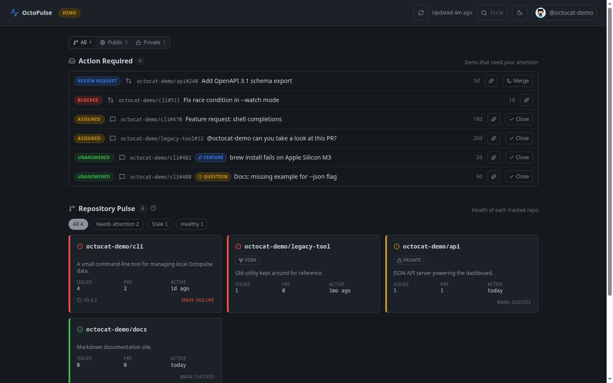

# OctoPulse

A zero-backend GitHub maintainer dashboard. Triage *what needs you* and *what's rotting* across many repos from a single page — no server, no data collection, no vendor lock-in.



- **Action Required Inbox** — review requests, assignments, blocked PRs, and unanswered external issues
- **Repository Pulse Grid** — health-at-a-glance for every tracked repo (green / amber / red)
- **Stale Watch** — open threads ranked by days-since-last-activity
- **One-click merge / close** — confirm modal, REST mutation, refresh
- **LLM-powered thread summarizer + intent classifier** — bring-your-own provider (OpenAI / Groq / OpenRouter / Gemini / any OpenAI-compatible endpoint, including local llama.cpp / Ollama)
- **Read-only or read & write** — pick a PAT lane at sign-in; write actions are hidden when read-only
- **Demo mode** — drive the full UI with no token

Everything runs in your browser. Your PAT and LLM key live in `localStorage` and are never transmitted anywhere except directly to the APIs they belong to.

---

## Get started

Pick the path that fits you. All three give you the same app.

### 1. Use the hosted version (zero setup)

<https://octopulse.kpsn.dev>

Open it, paste a PAT (or try demo mode), done. The whole app is static — the host serves bytes, never sees your token.

### 2. Self-host with Docker (one command)

```bash
docker run -d --name octopulse -p 8080:80 ghcr.io/kingpin/octopulse:latest
```

Then open <http://localhost:8080>. Multi-arch image (amd64 + arm64), nginx-served, ~63 MB. Updates with `docker pull`.

Prefer compose? Drop this in `docker-compose.yml`:

```yaml
services:
  octopulse:
    image: ghcr.io/kingpin/octopulse:latest
    ports: ["8080:80"]
    restart: unless-stopped
```

### 3. Self-host from source (static files)

```bash
git clone https://github.com/KingPin/OctoPulse.git
cd OctoPulse
npm install
npm run build        # outputs static dist/
```

Serve `dist/` from any static host. Common options:

- **GitHub Pages** — Settings → Pages → Source: **GitHub Actions**. `.github/workflows/deploy.yml` ships with this repo and builds on every push to `main`. Custom domain: edit `public/CNAME`. Project page (no domain): delete `public/CNAME` and set `base: '/<repo>/'` in `vite.config.ts`.
- **Cloudflare Pages** — build command `npm run build`, output `dist`, no env vars.
- **Vercel** — framework preset **Vite**, output `dist`, no functions.
- **Just on your laptop** — `cd dist && python3 -m http.server 8000`.

For local dev with hot reload: `npm run dev` → <http://localhost:5173>.

---

## GitHub Personal Access Token

OctoPulse needs a PAT to call the GitHub API directly from the browser. (Device Flow would be nicer but `github.com/login/device/code` blocks browser CORS.) Choose one of:

**Classic PAT** — quickest. Visit <https://github.com/settings/tokens/new?scopes=repo,read:org,read:user&description=OctoPulse>. The scopes `repo`, `read:org`, `read:user` are pre-filled. Generate, copy, paste into OctoPulse.

**Fine-grained PAT** (recommended for least-privilege) — Visit <https://github.com/settings/personal-access-tokens/new>. Grant access to the repos you want to track and the following permissions:
- **Issues** — Read & write (needed to close issues)
- **Pull requests** — Read & write (needed to merge PRs)
- **Contents** — Read
- **Metadata** — Read
- **Members** — Read (for org repos)

The token stays in your browser's `localStorage` under the key `octopulse:githubToken`. Use the **Sign out** button to clear it.

---

## LLM provider setup

Open the settings panel (gear icon, top right) → **AI Assistant** section. The summarizer + intent classifier are gated on a configured provider; the dashboard itself works without one.

| Provider | Where to get a key | Default model |
|---|---|---|
| **OpenAI** | <https://platform.openai.com/api-keys> | `gpt-4o-mini` |
| **Groq** | <https://console.groq.com/keys> | `llama-3.3-70b-versatile` |
| **OpenRouter** | <https://openrouter.ai/keys> | `openrouter/auto` |
| **Gemini** | <https://aistudio.google.com/apikey> | `gemini-2.0-flash` |
| **Custom (OpenAI-compatible)** | local — llama.cpp, LM Studio, Ollama, etc. | `llama3` (default base URL `http://localhost:11434/v1`) |

Click **Test** after pasting your key. Defaults rot fast — feel free to override the model. Keys persist in `localStorage` under `octopulse:llmConfig`.

> **Ollama users:** start Ollama with `OLLAMA_ORIGINS="*" ollama serve` (or your specific origin) so the browser can call it.

---

## Privacy & security

- Your PAT and LLM API key live in `localStorage` only. They never leave your browser except to the APIs they authenticate to (api.github.com, your configured LLM provider).
- No telemetry, no analytics, no third-party scripts.
- The whole app is a single static bundle; you can read the network tab and verify.
- The hosted version at octopulse.kpsn.dev is the exact build from `main` — same bytes you'd get from `npm run build` or the Docker image.

If you don't want OctoPulse to keep a token at all, use **demo mode**.

---

## Stack

Vite 8 · React 19 · TypeScript strict · Tailwind v4 · Lucide React · Vitest

GitHub data: GraphQL primary (`/graphql`) with REST fallbacks for the few endpoints GraphQL doesn't cover (merge PR, close issue, fetch issue body, fetch comments).

Refresh strategy: load + manual button + on tab-focus if the cache is older than 5 minutes.

---

## License

Apache License 2.0 — see [LICENSE](LICENSE).
